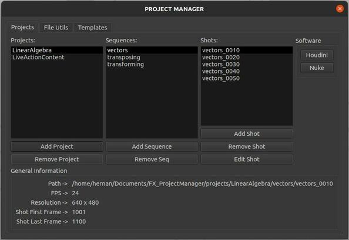
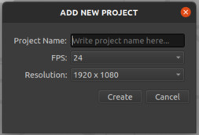
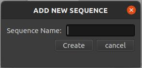
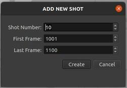

## FX Personal Project Manager

Hi there.

I am a Senior Houdini FXTD and CG Supervisor at Framestore.

With the goal of learning and getting better at python, and maybe along the way creating something that might help me out with the structure of my personal 
projects in the future, I decided to slowly create a set of tools that kind of work like a simple vfx pipeline for personal projects.

This is still work in progress and will remain like that for the long term.


There are VEX Snippets that you might find useful inside:
**FX_ProjectManager/ppm_lib/snippets/vexSnippets/**


 * Create a virtualenvironment inside the FX_ProjectManager folder and install the python dependecies defined on the **requirements.txt**.
 * Run ```pip install -r requirements.txt```. This will install the python libraries required.


####      Project manager window


Main hub that stores most of the functionalities that are not going to be run directly from the DCCs

####      New Project window


Allows to create new projects and adds them to the database

####      New Sequence window


Given the selected project, will allow the user to add a new sequence and will store it on the database

####      New Shot window


Given the selected sequence, will allow the user to create a new shot whose name will be the union of the sequence name 
and the shot number

####      File Renamer window


Work in progress, allows to rename files, offset the frame range, fix padding issues, and eventually will be a work with an instance of a FileSequence() object that will allow all the functionalities needed by a sequence of files.
