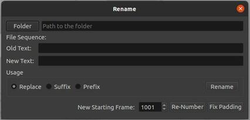
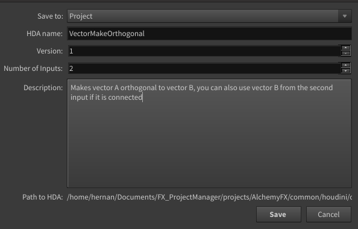

## FX Personal Project Manager
#### Using Python 3.8.10


Hi there.

With the goal of learning and getting better at python, and maybe along the way creating something that might help me out with the structure of my personal 
projects in the future, I decided to slowly create a set of tools that kind of work like a simple vfx pipeline for personal projects.

This is still work in progress and will remain like that for the long term.

Also, it works better on Linux, on Windows I am having problems when deleting an entity (Project, Sequence or Shot), other than that behaves as expected on Windows, although in general performes better on Linux where I have had less problems with the databases.

 

### Purpose
Standardize the way I create projects, load Software and Plugins, Save and Name files.
There will be utilities to work with file sequences, renaming, renumbering and converting formats.


There are VEX Snippets that you might find useful inside:
**FX_ProjectManager/ppm_lib/snippets/vexSnippets/**


### Installation steps

 * Create a virtualenvironment inside the FX_ProjectManager folder and install the python dependecies defined on the **requirements.txt**.
 * Run ```pip install -r requirements.txt```. This will install the python libraries required. On Windows you might need a different version of the same libraries
 * rename the ```./.env_example``` to ```./env``` and update it's contents to point to the installation folders on your system

The main initial UI is executed by running the python file stored in: FX_ProjectManager/ppm_lib/ppm_main_ui.py 

### Usage

 * cd yourFolder/FX_ProjectManager
 * source venv/bin/activate
 * cd yourFolder/FX_ProjectManager/ppm_lib/ppm_main_ui.py 
 * python3 ppm_main_ui.py

The **first part** of the manager is in charge of creation and modification of projects, sequences and shots, Modification of file sequences, ingesting of plates, conversion from DNG to EXR.

The **second part** of the manager is software based and works from inside each DCC "Nuke, and Houdini", which will let you open and save files, version up, manage versioning of caches, publishing of setups etc.

## PROJECT SETUP

####      Project manager window
Main hub that stores most of the functionalities that are not going to be run directly from the DCCs


####      New Project window
Allows to create new projects and adds them to the database


####      New Sequence window
Given the selected project, will allow the user to add a new sequence and will store it on the database


####      New Shot window
Given the selected sequence, will allow the user to create a new shot whose name will be the union of the sequence name 
and the shot number


####      File Renamer window
Work in progress, allows to rename files, offset the frame range, fix padding issues, and eventually will be a work with an instance of a FileSequence() object that will allow all the functionalities needed by a sequence of files.




## HOUDINI

#### PPM Shelf
The main Houdini functionalities are part of the PPM_Lib shelf tool


#### Open file
Displays the files saved in the current shot.


#### Save new file
Gives the user the option to name the file, it adds the prefix and postfix to the name keeping the naming convention of the pipeline.


#### OTL Publisher
WIP Converts a selected subnetwork into an HDA, if any spare parameters have been added to the subnetwork, they will be copied and added to the definition of the HDA.




